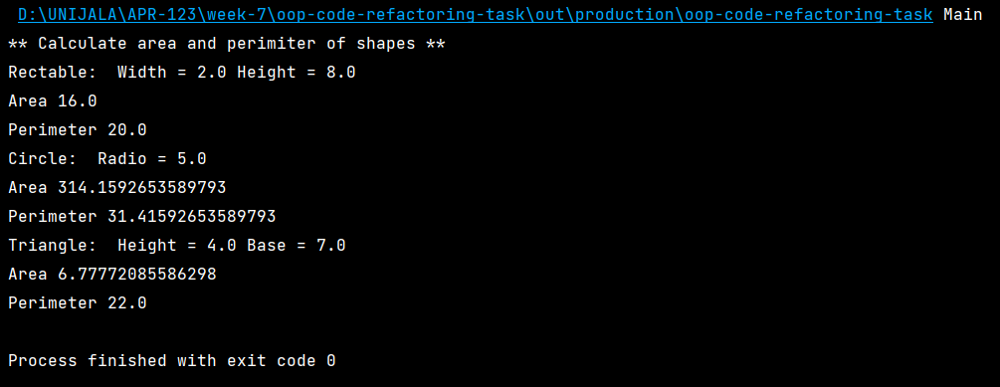
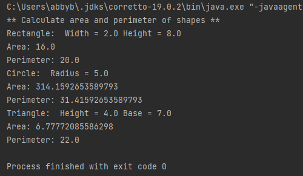
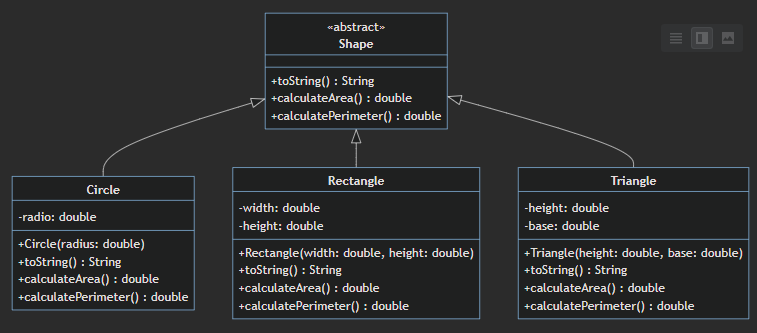

# OOP Example

Calculate the area and perimeter of shapes.

This design has a high cohesion and low coupling.
Refactor the relationships to have low  cohesion and high coupling.

In main function create a square with side 4, a circle with radius 5, a triangle with sides 4 and 7 and a rectangle with sides 8 and 2.

Expectativa:

Prueba del código refactorizado:

Diagrama:

